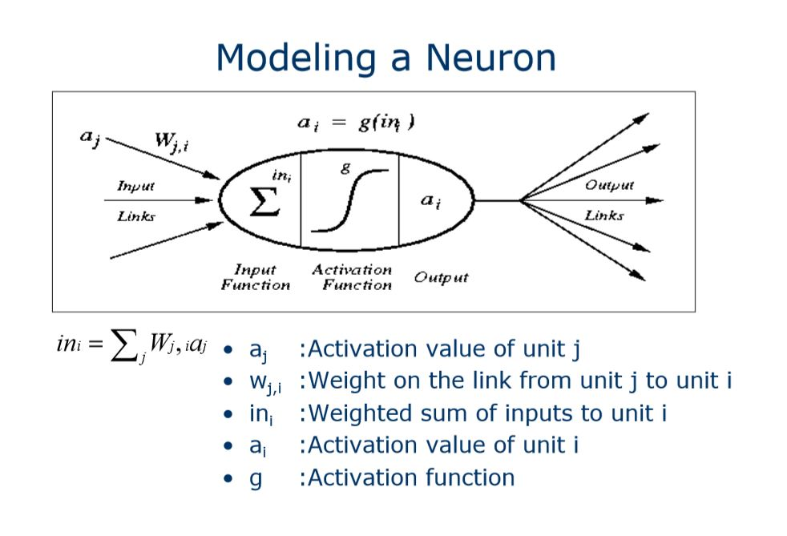
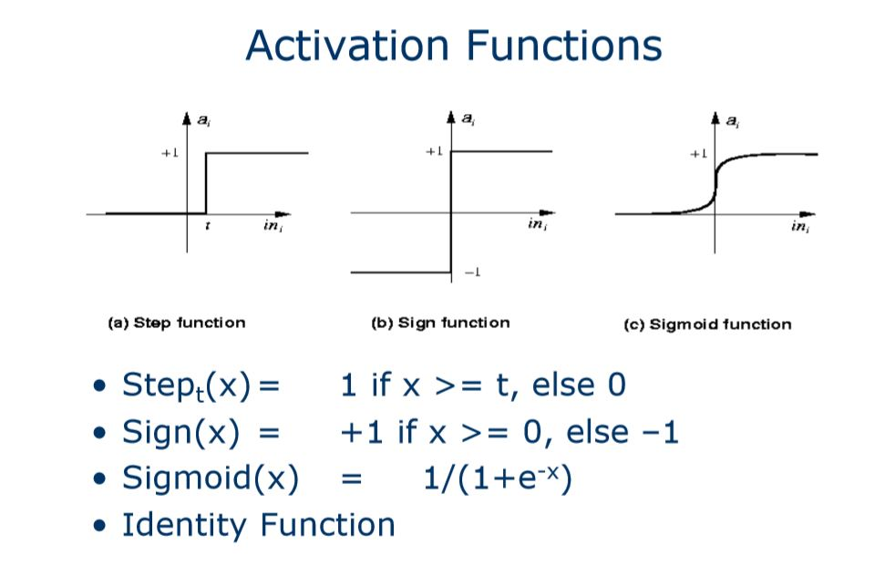
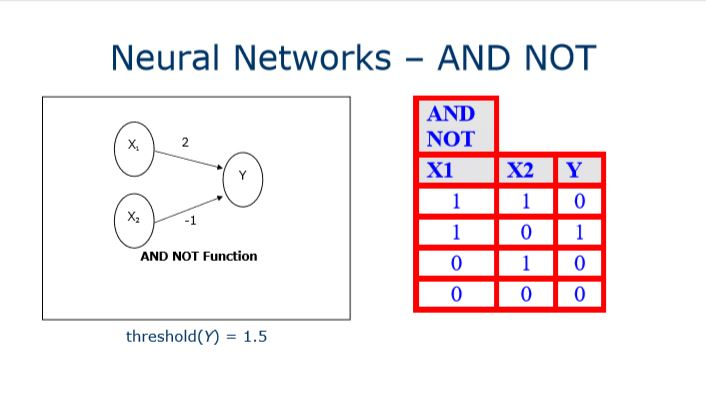
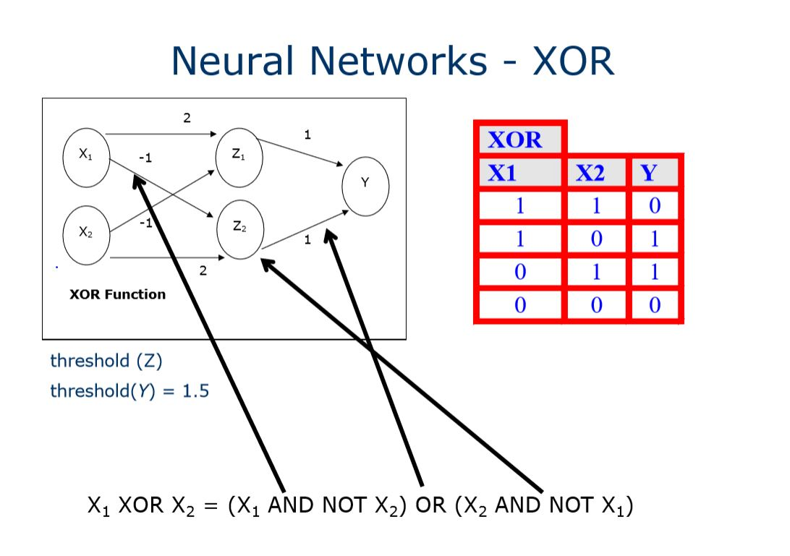
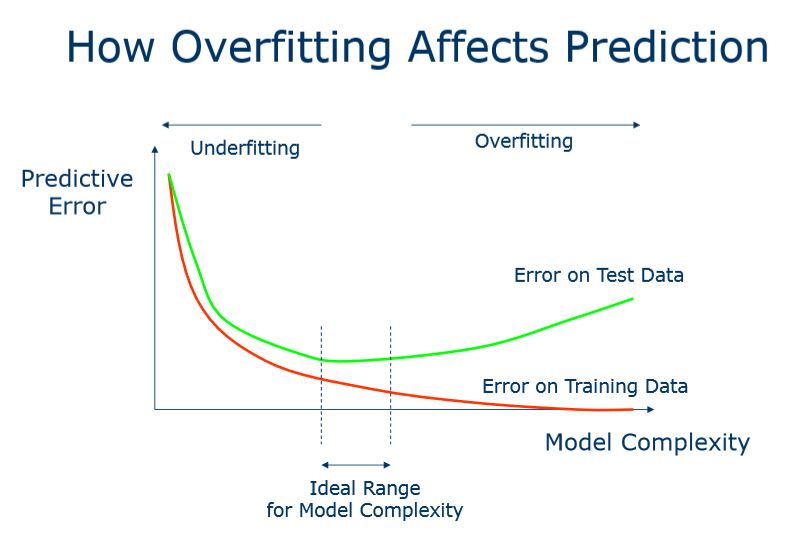

---
# L1 Introduction
### Big Oh notation : **O(f(n))**
- n is a measure of **problem size or runtime**
- Function f(n) is an **upper bound** on the *asymptotic behavoiur* ( as n gets very large)
- “Polynomial” means O(n^k) for some fixed k 
    - e.g.,  O(n^2)  
- “Exponential” means O(2^an) for some fixed a
     - e.g., O(2^n/20)

---
### Problem Formulation and Representation
Solving Problems by Searching
1. *goal* to be achieved
2. *actions*
3. what is the *representation*

Problem Components
1. Initial State
2. Operator(s)
    - The set of all possible states reachable from a given state by applying all legal action(s) is known as the **neighbourhood** and the action(s), **the successor function** 
3. Goal Test
4. Path Cost 
- *initial state and the successor function define the state space*
- *complexity of a problem depends on the size of the state space*

Search Trees ( a graph)
1. is connected but becomes disconnected on removing any edge
2. is connected and acyclic
3. has precisely one path between any two nodes

Trees - terminologies
- Nodes : contains information such as: state, parent node, action, path cost g(x), depth
  - Root node
  - Children Node
  - Parent Node
  - Leaves
- Branching Factor
  - Average number of children for the nodes of a tree
- depth, d, 

Evaluating a Good Search
1. Completeness
   - Is the strategy guaranteed to find a solution
2. Time Complexity
   - How long does it take to find a solution?
3. Space Complexity
   -How much memory does it take to perfom the search?
4. Optimality
   - Does the strategy find the optimal solution when there are several solutions
  ---
# L2 Blind Search
Definition : No additional information about states beyond that provided in the problem definition

Characteristics: 
1. can only generate successors
2. can distinguish between goals from non-goal state
3. expansion done systematically
4. constructs a search tree
   - *root* is the initial state
   - leaf nodes (fringe) are nodes discovered but not yet expanded
  
- State space VS search tree
  - Search space is **implicit tree** defined by **initial state** and the **operators**
  - Search tree is **explicit tree** generated by the **search strategy**
  
### State space
- states are generated during search
- *A solution* is a sequence of actions associated with a path in a state space from a **start** to a **goal state**
### Search tree
- may be *infinite* because of loopy or redundant paths

### Search Implementation
1. Fringe
   - have been discovered
   - but not "processed"
   - also known as open nodes, frontier, agenda
2. Explored nodes
   - have been discovered
   - have been "processed"
   - also known as close nodes

### 1. Breadth First Strategy
- guarantees finding the theoretical ans
- implementation : fringe is a **FIFO** queue
- will always find the **shallowest goal state**
- doesnt give the path to the goal

### 2. Depth-First Srategy
- explores a path all the way to a leaf before backtrackking and exploring another path
- implementation: fringe is a LIFO queue
- space complexity : branching factor x depth
- time complexity : b^m (worst case)
- neither complete nor optimal

### 3. Depth Limited Search
- imposes a depth limit, at which point the search terminates for that particular branch

### 4. Iterative Deepening Search
- IDS remedies the issue of choosing the right depth limit by sequentially trying all depth limits, first depth 0, then 1, then 2, and so on, until a solution is found
- In effect it is combining BFS and DFS

- Time complexitiy = O(b^d)
- Space complexity = O(bd)
- For large search spaces, where the depth of the solution is not known, IDS is normally the preferred search method

### Uniform Cost Search
- BFS will find the optimal solution provided that all step costs are equal
- always finds the cheapest solution

### State Space Search
1. Data driven search : starts from initial state and uses actions that are allowed to move forward until a goal is reached. Also known as forward chaining.
2. Goal-driven search : starts at the goal and works back towards a start state, by seeing what moves could have led to the goal state. Also known as backward chaining.
---   
# L3 Heuristic Search
- also known as informed search
- add domain-specific information to select the better path
- works by deciding which is the next best(guess) node to expand ( no guarantee it is the best node along the best path/solution)

- Heuristic function h(n) estimates the goodness of a node n
  - h(n) is the estimated cost or distance of minimal cost path from n to a goal state
- General properties:
  - h(n)>= 0 for all nodes *n*
  - h(n) = 0 implies *n* is a goal node

- Best-First Search
   - node selected for expansion bsaed on an evaluation function f(n), which incorporates heuristics
  
### 1. Greedy Search
- use as an evaluation function f(n)-h(n), sorting nodes by increasing values of f
- not complete
- not admissible
- finds solution without ever expanding a node that is NOT on a solution path
- solution path is **not optimal**
- short term gains
- time and space complexityy : O(B^m)

### 2. A* Search
- uses a combination of the actual cost to reach the current node from root and the estimated cost i.e. g(n) + h(n)
- avoid expanding paths that are already too exp
- evaluation function f(n)=g(n) + h(n) -> A*
  - g(n) the cost (so far) to reach the node 
  - h(n) estimated cost to get from the node to the goal 
  - f(n) estimated total cost of path through n to goal
- optimal and complete if heuristic function is admissible i.e. h(n) never overestimate the cost to reach the goal 

- Therefore, one way to measure the quality of a heuristic is to find its average branching factor 

# L5 Game Playing and Coevolution
- Coevolutionary systems- population of agents whose behavior changes in response to their interaction outcomes

- Problem solving tasks may involve some forms of decision-making processes

- Intelligent solution for strategic decision-making that can:
   - predict future outcomes
   - take appropriate decisions
   - adapt its behavior
- Game solutions
  - standard minimax approach(recursive search algorithm)
  - board state evaluation functions
  - alternative evolutionary approach

## Coevolutionary Learning 
- optimizing representation parameters( search for best strategy)
    - a learning task
    - variation to generate new solutions
    - selection to test solutions

- Fitness evaluations
- based on training error estimated from a teacher-target sample( game strategies ) that is evolving as well *coevolutionary systems*
- based on interactions between competing solutions are modeled as game-play
- survival of the fittest- process of adaptation
  
## Coevolutionary Learning Framework
Generate-and-Test procedure:
1. initialize population, X(t=1)
2. Evaluate fitness through interactions (game plays) between population members (agents)
3. Select parents from X(t) based on fitness.
4. Generate offspring from parents to obtain X(t+1)
5. Repeat steps (2-4)until some termination criteria are met

*The iteration count t is termed generation*

## Prisoner's Dilemma
Constraints:
- T>R>P>S
- R>(S+T)/2

- learning of behaviours through an adaptation process
- simulates and models the specific conditions that lead to the learning outcomes of certain behaviours
- 

# L6 Neural Networks
## Modeling a neuron
- In a simple model, the first layer is the input layer, followed by one hidden layer, and lastly by an output layer. Each layer can contain one or more neurons
   

- the arriving signals, called inputs, multiplied by the connection weights (adjusted) are first summed (combined) and then passed through a transfer function to produce the output for that neuron. The activation function is the weighed sum of the neuron’s inputs and the most commonly used transfer function is the sigmoid function
- Weights shows the strength of the particular node.
- A bias value allows you to shift the activation function curve up or down.

### Activation Function

## Perceptron
- The perceptron is a type of artificial neural networks. It can be seen as the simplest kind of feedforward neural network: a linear classifier.
- perceptron is an algorithm for supervised learning of binary classifiers
- Only LINEARLY SEPARABLE functions can be represented by a perceptron 
- The dimensionality of function space is equal to the number of inputs, which will typically be higher than 2!
- Separation in this case is by a hyperplane of (dimensionality – 1)
-  The activation function uses some means or other to reduce the sum of input values to a 1 or a 0 (or a value very close to a 1 or 0) in order to represent activation or lack thereof

- x1 AND (NOT)X2 = Y
- 1 0 0 
- 1 1 1
- 0 0 0
- 0 1 0
  
- An epoch is a term used in machine learning and indicates the number of passes through the entire training dataset the machine learning algorithm has completed.

- While epoch produces an error 
    - Present network with next inputs from epoch 
    - Err = T – O
    - If |Err| > 0 
    - then Wj = Wj + LR * Ij * Err 
    - End If 
    - End While
- Ij : Inputs being presented to the neuron 
- Wj: Weight from input neuron (Ij) to the output neuron 
- LR : The learning rate. This dictates how quickly the network converges. It is set by a matter of experimentation. It is typically 0.1 
- Error, Err : It is the amount by which the value output by the network differs from the training value. For example, if we required the network to output 0 and it output a 1, then Err = -1

XOR

  
# Machine Learning
## k-fold Cross variation
- Cross-validation is primarily used in applied machine learning to estimate the skill of a machine learning model on unseen data.

- This approach involves randomly dividing the set of observations into k groups, or folds, of approximately equal size. The first fold is treated as a validation set, and the method is fit on the remaining k − 1 folds.

- **Overfitting** occurs when a statistical model or machine learning algorithm **captures the noise of the data**. Intuitively, overfitting occurs when the model or the algorithm **fits the data too well**.  Specifically, overfitting occurs if the model or algorithm shows **low bias but high variance**. Overfitting is often a result of an excessively complicated model, and it can be prevented by fitting multiple models and using validation or cross-validation to compare their predictive accuracies on test data.
 
- **Underfitting** occurs when a statistical model or machine learning algorithm **cannot capture the underlying trend of the data**. Intuitively, underfitting occurs when the model or the algorithm **does not fit the data well enough**. Specifically, underfitting occurs if the model or algorithm shows **low variance but high bias**.  Underfitting is often a result of an excessively simple model.

- A model that is underfit will have high training and high testing error
-  an overfit model will have extremely low training error but a high testing error.

### The Holdout Method
1. randomly split examples into training set U and test set V
2. use training set to learn a hypothesis H
3. measure % of V correctly classified by H
4. The hold-out method splits the data into training data and test data (usually 2/3 for train, 1/3 for test, or 90/10 split)
  
### v-Fold Cross Validation Method
