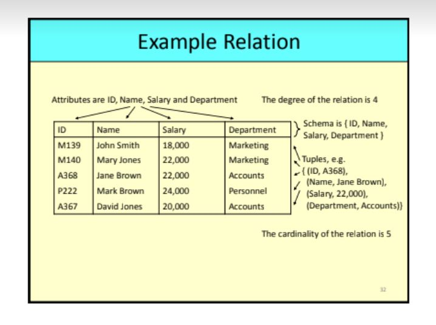

# DBI tips
1. 3 sections

# Case Study 20
1. Design tables
2. ERD
3. Entity
4. Relationship

# Two tables given 15
1. Use SQL commands to construct an output
2. Given a table from combination of two tables
3. SQL command given, write what will be produced

# Theory Question
1. CSS -> border
2. JQuery -> functional, event, handler…
3. HTML -> Tag, command
4. JScript -> Output will be given, construct the code

# Introduction
## Relational Data Structure
- schema is a set of attributes
- a tuple assigns a value to each attribute in the schema
- a relation is a set of tuples with the same schema
 


- data is stored in **relations (tables)**
- relations are made up of **attributes (columns)**
- data takes the form of **tuples (rows)** 
- **degree of relation** : how many columns the table has
- **cardinality of a relation** : how many rows

## NULLS and Primary Keys
- NULL indicates a missing or unknown value
- not the same as 0 or blank space character

- primary key : chosen to identify tuples in a relation
- **entity integrity** : primary keys cannot contain NULL values

- foreign kets : link data in two relations. A set of attributes in the first(referencing) relation is a Foreign Key if its value :
  - matches a primary key value in a second(referenced) relation
  - is NULL
- this called **referential integrity**
- restrict, cascade and set null

## Entity Relationship Modelling
- entities: objects or items of interest
  - boxes with rounded corners
- attributes: properties of an entity
  - drawn as ovals
  - linked to its entity by a line
- relationships: links between entities
  - diamond box
  - ends of the link show cardinality

Cardinality ratios
- one to one (1:1)
- one to many (1:M)
- many to many (M:M)
  - split a many to many relationship to two one to many relationships
  - an additional entitiy is created 

SQL - Structured Query Language
- DDL : Data Definition Language
- DML : Data Manipulation Language
- DCL : Data Control Language
  
```sql
--create database
CREATE DATABASE NAME
--use database
USE NAME
--create table
CREATE TABLE TABLE-NAME  (
    column1 datatype,
    column2 datatype,
);
    example
CREATE TABLE Student ( 
    sID INT AUTO_INCREMENT,
    sName VARCHAR(50) NOT NULL,
    sAddress VARCHAR(255),
    sYear INT DEFAULT 1
    CONSTRAINT mod_pk PRIMARY KEY(sID)
);
--constraints
--primary key automatically adds UNIQUE and NOT NULL

--deleting tables
DROP TABLE Module;
DROP TABLE IF EXISTS Module, Student;

--changing tables
    --add column,remove column,add new constraint, remove constraint,change column name
ALTER TABlE table-name

--INSERT,UPDATE,DELETE
INSERT INTO table_name
VALUES (value1, value2, vl..);

UPDATE table_name
SET column1= value1, column2=value2,...
WHERE condition;

DELETE FROM table_name 
WHERE condition;

--select
SELECT columns
FROM table-name
WHERE condition
GROUP BY column_name(s)
HAVING condition
ORDER BY column_name(s)

```
## Joins
1. A CROSS JOIN B
   - returns all pairs of rows from A and B, the same as Cartesian Product

2. A INNER JOIN B
   - returns pairs of rows satisfying a condition
  
3. A NATURAL JOIN B
   - returns pairs of rows with common values in identically named columns

4. A OUTERJOIN B
   - returns pairs of rows satisfying a condition(as INNER JOIN) but also **handles NULLS**


---
# PHP
```PHP
<p>
<?php
    echo "This is PHP!";
?>
</p>
```
- variable names all starts with the $ character
  - $username = "Fred Smith"
  - $count = 17

- string concatenation
  ```php
  echo 'You have ' .$msgs . 'messages.' ;
  OR
  echo "You have $msgs messages.";
  ```

### Superglobals
- built in global variables
- names **start $_**
- contain various session data -e.g.
  - $GLOBALS - list of all global variables
  - $_SERVER - contains server information
  - $_GET - contains data from web forms submitted by GET
  - $_POST - contains data from forms submitted by POST
  - $_SESSION - acesses session variables
  - $_COOKIE - accesses cookies

### HTML Forms
- **action** attribute is the name of the script
- **method** attribute is the HTTP protocol used to transmit the data (either PUT or GET)

form example GET
```html
<html>
<body>

<form action= "hello.php" method="GET">
    What is your name?
    <input type= "text" name="personName">
    <input type= "submit">
</form>
</body>
</html>
```
```PHP
<html>
<body>
<h2> 
    Hello
    <?php echo $_GET["personName"];?>
</h2>
</body>
</html>
```
### GET VS POST
- HTML forms are used to submit user data to PHP scripts
- Different HTTP request methods
- GET passes data on the URL
- POST passes data from the server to the browser internally
  - GET requests can be cached, bookmarked, and remain in the browser POST does not
  - GET requests have length restrictions, POST does not
  - GET requests are visible to everyone so its easy to reverse engineer
  - POST requests are invinsible so more secure

### Session Variables and Cookies
- Both store variables

| Session Variables | Cookies |
|:------------------|:--------|
| stored in memory on the server | stored in a file on the client |
| persist for the duration of the "session" 24 minutes or less if the session is explicitly ended | persist until expiration(seconds to months)|
| browser agnostic | browser specific|  

- cookies must be set **before** the <html> tag
- time is usually in days
- intended for long term storage of information
- not compatible across browsers
- cookies can be disabled by browsers
- moderately but not totally secure

  ---
# JQuery
- JavaScript library
- platform independent
- DOM ( Document Object Modelling)manipulation library
- effects and animations
- perform AJAX request

### General Syntax
```JQuery
$(selector).action()
```
    $- acess JQuery
    (selector) - finds HTML elements
    action() - a method to be performed on the elements

For example:
```JQuery
    $("h2") - hides all <h2> elements
    $("#demo").hide() -  hides all elements with id="demo"
```
- JQuery is always inside the "Document Ready" event
    - triggered when the document is fully loadedd
- always defined in the head of HTML
  ```
  $(document).ready( function(){
      .....
  })
  ```
###  Selectors
Select a HTML element based upon:
- name
- id attribute
- class attribute
- types position in the document
- other attributes
- values of the attributes
  


### Events
- something happens to the web page to trigger the event
- Examples:
  - mouse events - click() dblclick(), mouseenter(), mouseleave()
  - keyboard events - keypress(), keydown(), keyup()
  - form events - submit(), change(), focus(), blur()
  - document events - load(), unload(), resize(), scroll()

- example
  ```JQuery
  <script>
  $(function(){
      $("button").click(function(){
          $("h1").fadeOut(2000);
      });
  });
  </script>
  ```

### Simple JQuery Effects
- hide() show() toggle()
- fadeIn() fadeOut() fadeToggle() fadeTo()
- slideDown() slideUp() slideToggle()

### Animations
- animate() method
 $(selector).animate({params},speed,callback);
- multiple properties can be manipulated
- animations can be queued