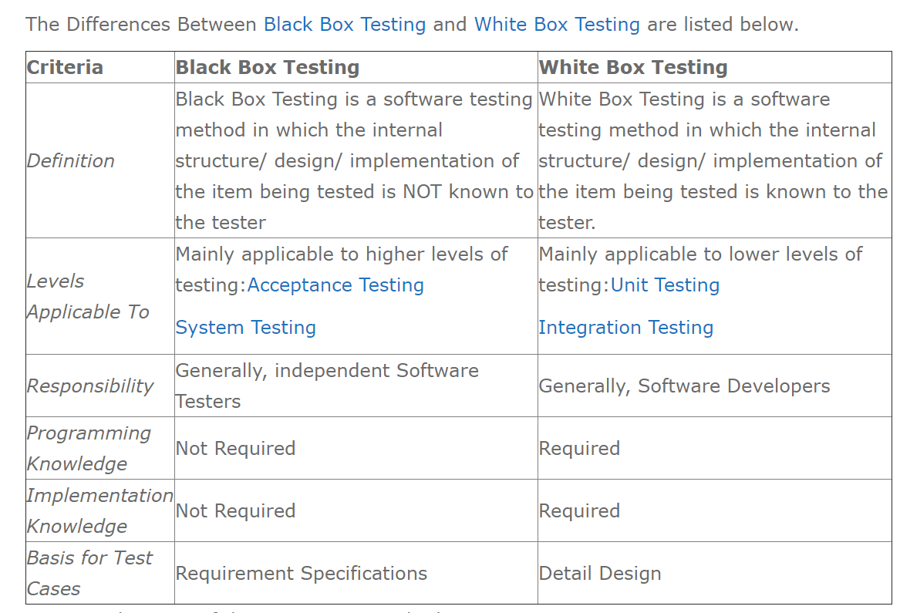
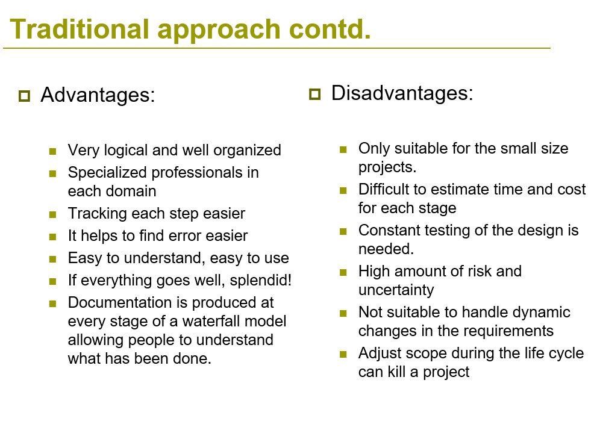
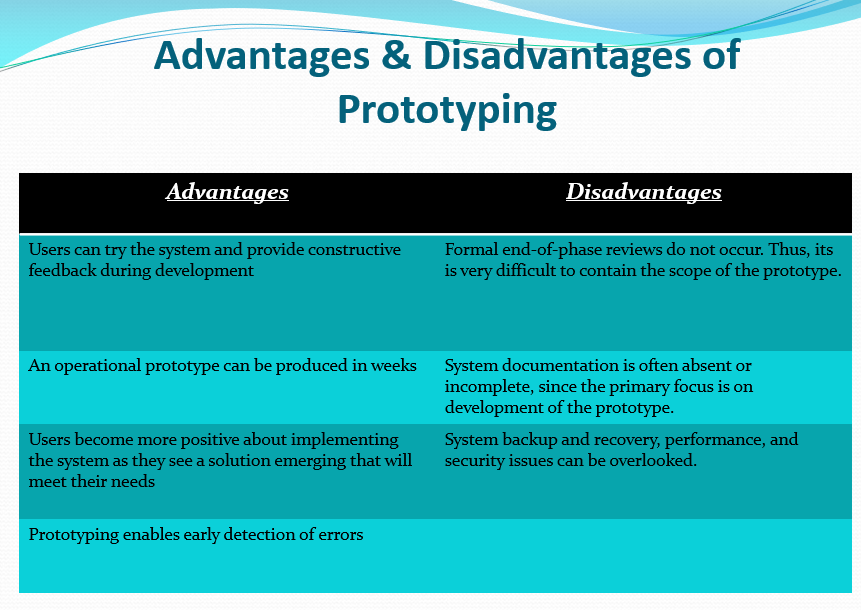
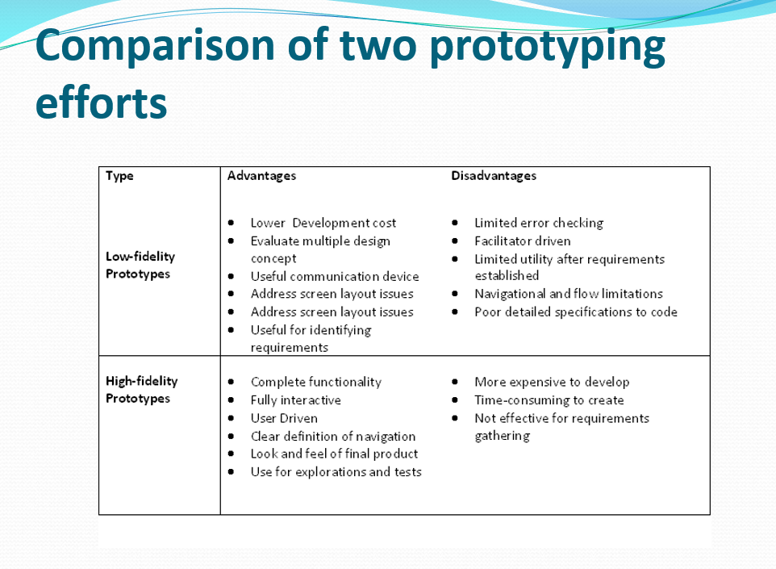
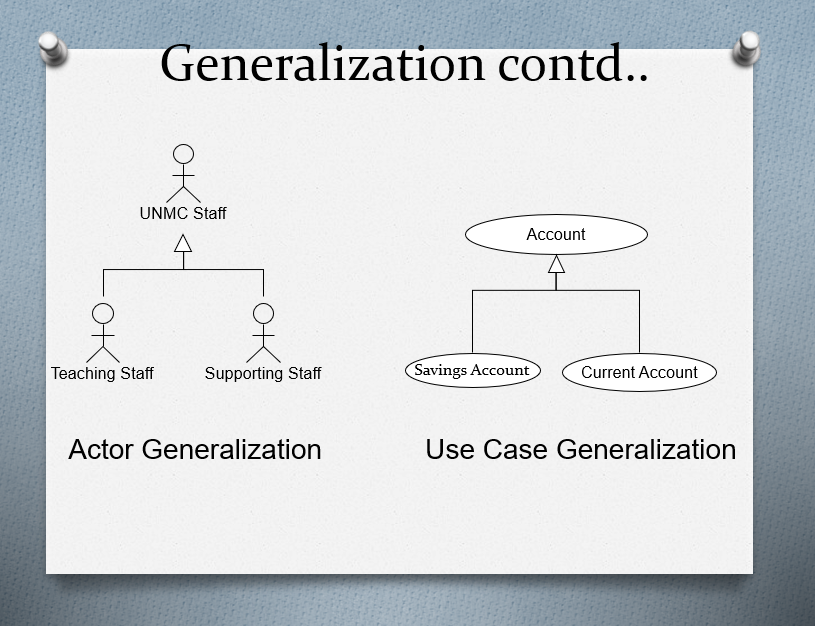
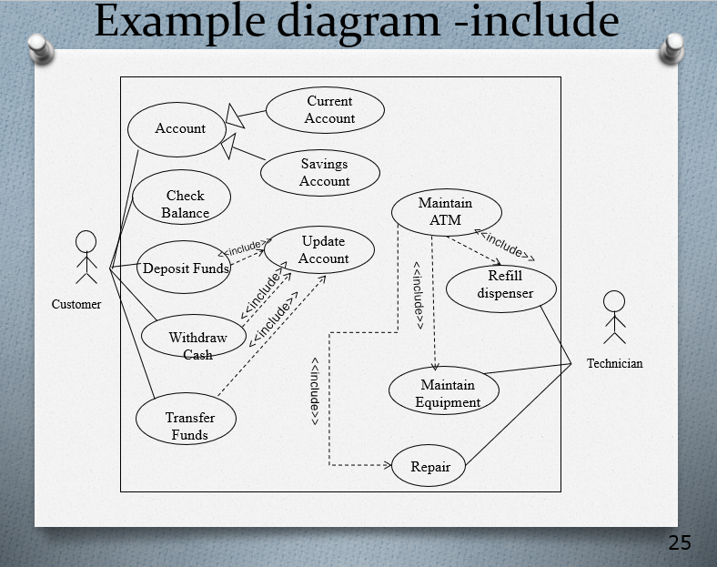
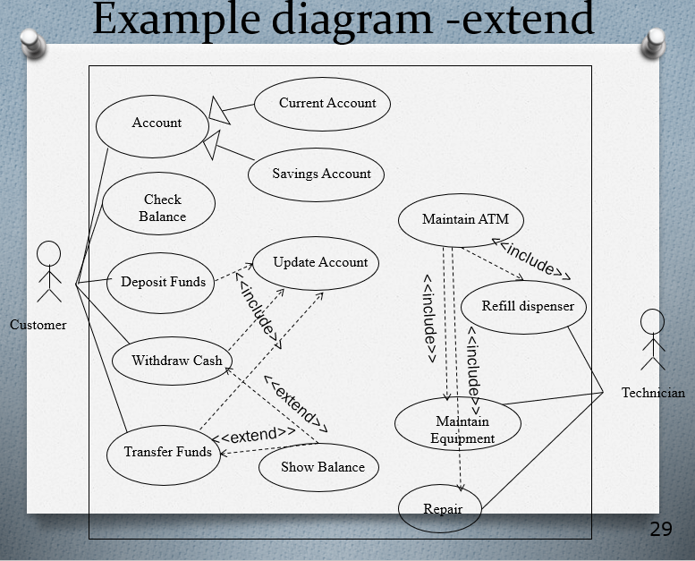
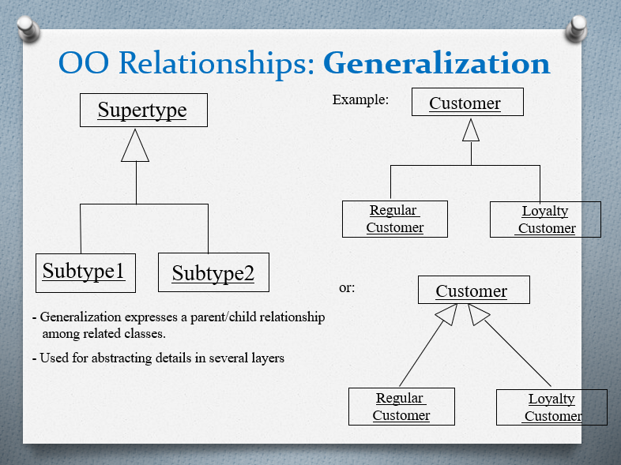
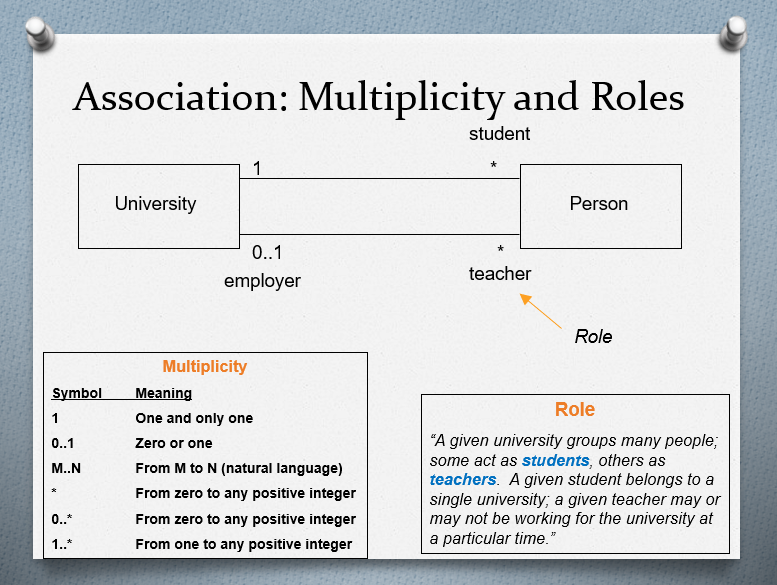

# Week 10 and 11
# Software testing and version Control 
## Tips
- why testing is used
- what is unit testing, system testing , integration testing
- differences between black and white box

## Why testing is used
- Ensure quality of the product
- Saves money ( bugs in earlier stages)
- Customer satisfaction 
  
## Software Testing 
- Formal documentation
- Test cases: Pass/Fail
  - outputs are bug reports and validation
- Test Suite Document
  - specify a sequence of actions 
  - put test cases into an executable order
- Automated Testing
  
## Unit Test
- a piece of code which tests behaviour of a function or class

## Integration Testing
- The functional specification of the element being integrated
- Integration testing is done to test the modules/components when integrated to verify that they work as expected
- Integrate/combine the unit tested module one by one and test the behavior as a combined unit

## System testing
- a level of software testing where a complete and integrated software is tested. 
- The purpose of this test is to evaluate the system’s compliance with the specified requirements.
- The process of testing an integrated system to verify that it meets specified requirements

## Acceptance testing
- Formal testing with respect to user needs, requirements, and business processes conducted to determine whether or not a system satisfies the acceptance criteria and to enable the user, customers or other authorized entity to determine whether or not to accept the system

## White Box Testing
- Tests the design structure and interactions of functional code
- Require knowledge of the internals of the system

## Black Box Testing
- treats the product as a finished system, no knowledge of the internal workings
- users perspective

## Differences

---
# Week 8 and 9
# Agile Software Developent

## Tips
- details about waterfall and spiral model
- advantages and disadvantages of traditional approach
- why ppl moved from traditional to agile (7 reasons)
- ignore scrum 

## Traditional Approach
- Requirements -> Design -> Implementation -> Testing -> Deployment and Maintenance
- In sequential order, no way back
  
## Advantages and Disadvantages

## Waterfall Model
- requirements are well known
- product definition is stable
- technology is understood
- new version of existing product
- inflexible structure of product

### problems:
- a lot of waiting time for developers
- tons of documentaition
- costly unnoticed mistakes and buggy code
- hard to incorporate new or changing customer requirements

- Unclear requirements 
- Requirements change 
- Lack of involvement of the customers 
- Accuracy of estimation 
- Uneven loading of the resources 
- Last minute correction is very difficult
- Not much time for testing
- No time to fix test defects 
- Lot of documentation
- Schedule and cost overruns
- Customers not happy 

## 7 reasons to move to Agile
1. Ambiguous Requirements
2.   Requirements Changes are Inevitable
3. Big, Upfront Planning is not Practical
4. Reviewing the working software is better than reviewing the documents.
5. Iterative and incremental development is better than sequential waterfall development
6. Delivery through small steps is better than a single huge delivery at the end of delivery life cycle. 
7. Frequent reflection by the project team is very important.

---
# Week 6 and 7
# Prototyping
## tips
- definition of prototyping
- importance of prototype 
- types of prototyping
- problems with prototyping
- advantages and disadvantages

## Definition
the process of quickly putting together a working model (a prototype)
 in order to **test various aspects** of a **design, illustrate ideas** or features and gather **early user feedback** 

## Need for prototyping
- enables us to **explore the problem space** with the stake holders
- as a requirements artifcats to **initially envision** the system
- as a design artifact that enables us to **explore the solution space** of your system
- a vehicle for you to **communicate the possible UI** design(s) of your system
- a potential foundation from which to **continue developing the system**

## Importance of prototyping
1. allow us to reduce the cost and time-to-market of a system
2. for companies building critical systems, prototyping would help them **perform formal verification**. Provide high level of reliability in the system design and implementation

## Advantages and Disadvantages of Prototyping

## Types of Prototyping
## 1. Throw Away Prototype
- developed from the **initial requirements** but is not used for the final project
- written specifications of the requirements
- some believe that this type is a **waste of time** bc u dont use it
- concentrates experimenting with the customer requirements that are poorly understood  
  
|Advantages|Disadvantages|
|:---------|:------------|
|Significantly reduce project risk|The prototype actually does nothing, just presentational|
|Has a short project timeline|Only for a limited purpose|

## 2. Evolutionary Prototype
   - most funcamental form of prototyping
   - build a robust prototype and constantly improve it
   - objective to deliver a working system to the end user
   - prototype eventually become the product

|Advantages|Disadvantages|
|:---------|:------------|
|Always looking for new ways to improve the system| avoid documenting the requirements of the system|
|Increases the chance of **having the client satisfied** with the working system| management is required|
|when the requirements are not defined| long term maintenance can be expensive|
|quickly delivery of the system| uncertain design idea's
| | information can be lost through so many improvement changes|

## 3. Low-Fidelity Prototyping
- **limited function, limited interaction** prototyping effort
- constructed to **depict concepts, design alternatives and screen layouts**. Intended to **demonstrate general look** and feel of the interface
- created to educated, communicate and inform, but not to train, test or serve as a basis for which to code
- **used early in the design cycle** to show general conceptual approaches

## 4. Medium fidelity prototype
- limited functionality but clickable areas which presents the interactions and navigation possibilities of an application
- usually built upon storyboards or user scenarios
- correct content dscription is emphasized. a basic visual design is created for every actions tep
- suited for the validation of the interaction concept
- understandability of interaction elements can be validated

Advantages:
- the impression of an already functioning application makes it easy for all stakeholders to derive processes from the range of features. This way the solution can be developed in the sense of the prototype.

## 5. High-Fidelity Prototyping
- the core functionality of the products user interface
- fully interactive systems 
- trade-off speed for accuracy
- consume resources and have high cost

## 6. User Interface Prototyping
- development of highly ineractive software system with gui
- depnds highly on the quality of the GUI
- generate ideas on how the GUI can be designed and helps to evaluate the quality of solution at an early stage

## Risks in Prototyping
1. client may believe system is real. unrealistic expectations of the progess
2. implementers make poor choice
3. prototype is not identical to the real system
---
# Week 5
# Software Design
- UML
- Advantages of UML
- why ppl started using UML
- types of UML
- Name system on top tight of use case diagram
- include and extend, generalization ( arrow points towards parents)

## UML (Unified Modelling Language)
- a family of graphical notations that help in describing, desgining and organising object oriented software systems
- a industry-standard graphical language for specifying, visualizing, constructing, and documenting the artifacts of software systems
  
## Advantages of UML
1. captures business processes
2. enhance communication and ensures the right communication
3. capability to capture the logical software architecture independent of the implementation language
4. manages the complexity
5. enables reuse of the design

## Why use UML?
1. use graphical notation: clearer than natural language(imprecise) and code (too detailed)
2. gives an **overall view of a system**
3. not dependent on any one language or technology
4. moves us from fragmentation to standardization

## Types of UML diagrams
## 1. Use Case diagrams
- describes the functional behavior of the system as seen by the user
- a set of scenarios tied tgt by a common user goal
- scenario is a sequence of stpes describing an interaction between a user and a system 

A full use-case model comprise of:
    1. overview of visible use scenarios in the system
    2. actors that interact with the system
    3. linkages between use cases
- A document describing the use case in details
Actor
- a role that a user plays w.r.t the system: user, external system(another system)
- has a unique name and an optional description

## Why use use cases?
1. for functional requirements analysis and specification
2. a use case is a description of **how a user will use the system-to-be to accomplish business goals**
3. use cases work well as an analytical tool
4. easy to understand, both for the business and from the technological point of view
    - used to gather requirements of a system
    - used to get an outside view of a system
    - identify external and internal factors influencing the system

## Relationships betweeen use cases
1. generalization: uses cases that are **specialized versions of other use cases**
    - child use case inherits the behaviour and meaning of the parent use case
    - child may add to or ovveride the behavior of its parent

2. include: use cases that are **included** as parts of other use cases. enable to factor **comon behaviour**
   - explicitly incorporates the behaviour of another use case
   - included use case occurs as a part of some larger base that **includes it**
   - <<include>> relationship represents common functionality needed in more than one use case
   - arrow points from base use case towards right hand side
  

3. extend: use cases that **extend** the behaviour of oher core use cases. enable to factor variants
    - implicitly incorporates the behaviour of another use case at certain points called **extension points**
    - the extension of the use case to include optional functionality
    - arrow points from extended area towards left hand side

## 2. Class diagrams
- describe the static structure of the system: Objects, attributes, associations
- **structure and behavior**in the use cases
- graphical way to illustrate relationships between classes in an Object Oriented System
- used for **requirement capture**, end user interaction

## Object Oriented(Class) Relationships
1. dependency relationship
   - indicates a semantic relationship between two or more elements
2. Generalization
    - connects a subclass to its supercalss
    - denotes an inheritance of attributes and behavior

3. association
- represent relationship between instances of classes

   - **aggregation**: specifies a whole-part relationship between an aggregate and a constituent part
      - denotes by a hollow-diamond adornment on the association
      - container and containee relationship
   - **composition** : indicates a strong ownership and coincident lifetime of parts by the whole
      -denoted by a filled-diamond adornment on the association
     
## 3. Sequence diagrams
- describes the dynamic behavoir between objects of the system

---
# Week 4
# Interaction Diagrams
## tips
- class diagram, activity diagram
UML specifies a number of interaction diagrams to model dynamic aspects of the system
    - messages moving among objects/classes
    - flow of control among objects
    - sequences of events

## Sequence Diagrams
- shows **interaction** between objects over a specific **period time**
- show the lifetime of an object
- describe the flow of the messages, events, actions between objects
- used during **analysis and design** to document and understand the logical flow of the system

## Key Parts
1. participants: object or entity that acts in the diagram
2. message
3. axes: 
   - horizontal: which object is acting
   - vertical: time (down -> forward in time)

## Activity Diagram
- describe how activities are co-ordinated
- support parallel behaviour
- analyse use case, understand workflow across many use cases
  
## Summary
- UML are useful for **staying organised** and for **communication** with team members or clients
---
# Week 2 and 3
# From Requirements to Analysis
## tips
- requirement analysis
- functional and non-functional
- what is software engineering
- what are software requirements
- generic vs customized products
- four stage process

## What is Software Engineering
- the application of a systematic, disciplined, quantifiable approach to the development, operation, and maintenance of the software
    - define software requirements
    - perform software design
    - software constructions
    - software testing
    - software maintenance tasks
    - software project management

## Software Development
Requirement Analysis -> Design -> Construction -> Testing

## Requirement Analysis
1. identify customers needs
2. evaluate system for feasibility
3. perform economic and technical analysis
4. allocate functions to system elements
5. establish schedule and constraints
6. create system definitions

## Software Requirement Analysis Phase
1. Problem recognition
2. Evaluation and synthesis (focus is on **WHAT** not HOW)
3. Modeling
4. Specification
5. Review

## Requirements
- features of system or system function used to fulfill system purpose
- focus on customer's **needs and problems** not on solutions
  - requirements definition document ( for customer )
  - requirements specification document ( for programmer, technical staff )

## Software Requirements
- defines the functionality of the system
  - answers the question **"what" , not "how"**
  - define constraints on the system
- two kinds of requirements
    1. functional requirements
        - describes **what** a software system should do
    2. non-functional requirements
        - place constraints on **how** the system will do so

## Software Products ( Generic VS Customized )
| Generic Products  | Customized Products |
|:------------------|:--------------------|
|stand-alone systems that are marketed and sold to any customer who wishes to buy them | software that is commissioned by a specific customer to meet their own needs |
| **specification of what the software should do** is owned by the software developer and **decisions on software change** are made by the developer | **specification of what the software should do** is owned by the customer and **decisions on software change** are made by the customers |
| ex: graphics programs, project management tools, CAD software, software for specific markets such as appointment systems for dentists | ex: embedded control systems, air traffic control software, traffic monitoring systems |

## Domain Requirements
- describe the system characteristics and features that reflect the domain
- may be new functional requirements, constraints one xisting requirements or define specific computations
- if doman requirements are not satisfied, the system may be unworkable
  
## Four Stage Process
1. **Feasibility Study**
   - find out if the current user needs to be satisfied given the available technology and budget
2. **Requirements Analysis**
   - find out what stakeholders require from the system
3. **Requirements Definition**
   - define the requirements in a form understandabl to the **customer**
4. **Requirements Specification**
   - define the requirements in detail in a form understandable to the **developers**